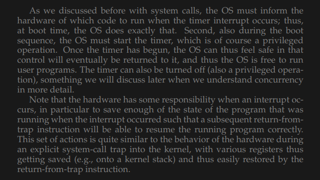

The most efficient way to run a program is to run it directly on the cpu. But there are two main problems with this approach.  
How do we prevent the program or process from accessing something it isn't supposed to access, like starting I/O, writing to read-only files etc.  
Ans: We can use two modes. User mode and kernel mode(Full access). If a process wants to run a command that requires the kernel, it can use a **trap** instruction to invoke the kernel and switch to kernel mode . The call will run and then the **return-from-trap** instruction will bring the process back to the user mode. However to prevent the process from doing something its not supposed to , we also use a **trap table** that is created when the kernel boots and it contains information on what to do when a program calls trap.  
How do we switch between processes to enable multitasking.  
Ans: How is the OS supposed to take back the cpu from a running process so that it can start another one? There are two approaches to this. First is the cooperative approach, where the OS trusts the process that it will return the CPU to the OS . This usually happens when programs call **yield** which gives back the control to the OS . Another example is when a program does something illegal, like accessing illegal memory , it generates a trap and the OS gets control of the CPU and punishes the process,(Just kills it '-'). The other approach is the non-cooperative approach where the OS forcefully takes back the cpu from a running process. This is done by using a timer interrupt. It raises an interrupt every few milliseconds and the interrupt handler gives control back to the OS.
  
The OS also saves the context for each program that it stops and loads the context for the program it is going to run . This process is called a context_switch.

